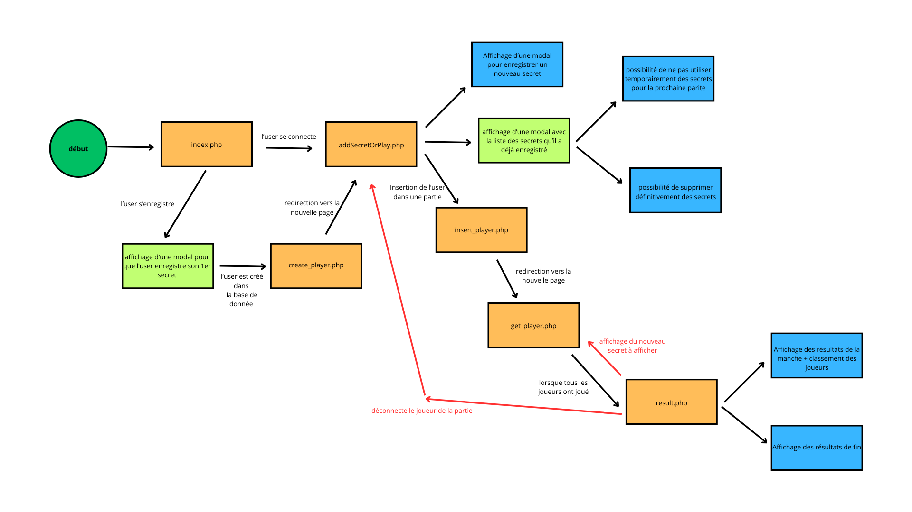

# Explication de l'utilité des fichiers pour le front

Le schéma ci-dessus résume le fonctionnement de chaque fichiers pour le jeu.

#### les fichiers affichés à l'utilisateur
Pour expliquer plus en détails,
- index.php : c'est la toute première page laissant à l'utilisateur le choix soit de se connecter ou de s'enregistrer

- create_player.php : insère le joueur qui vient de s'enregistrer en base de données

- addSecretOrPlay.php : ce fichier permet de donner le choix au joueur d'ajouter un nouveau secret sur son compte + voir la liste des secrets qu'il a déjà enregistré + la possibilité de s'insèrer dans une partie

- insert_player.php : créer une session de jeu si aucune session n'a été créer + insère un joueur dans une session de jeu

- get_player.php : affiche tous les joueurs connectés dans la partie + permet à chaque joueur de jouer en glissant et en déposant le joueur dont il pense être l'auteur du secret affiché à tous

- result.php : affiche le classement de chaque joueur à chaque fin de tour et le résultat du choix du joueur. S'il n'y a plus de secrets à découvrir pour les joueurs, cette écran affiche d'abord un podium des 3 premiers de toute la partie. Puis, cela affiche le classement de tous les joueurs.

#### les fichiers utilisés dans l'ensemble des fichiers 
- helper.php : ce fichier stocke toutes mes fonctions php lorsque j'ai besoin de faire des requêtes à la base de données.

- helper.js : stocke toutes les fonctions js et requêtes ajax dont j'ai besoin

- script_game.js : stocke tous les event listeners que j'utilise dans le projet.

- conn.php : stocke les connexions à la base de données 